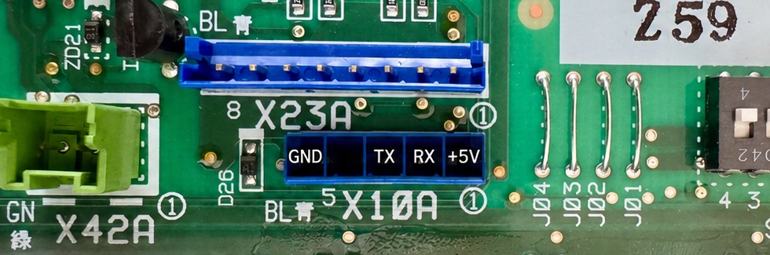
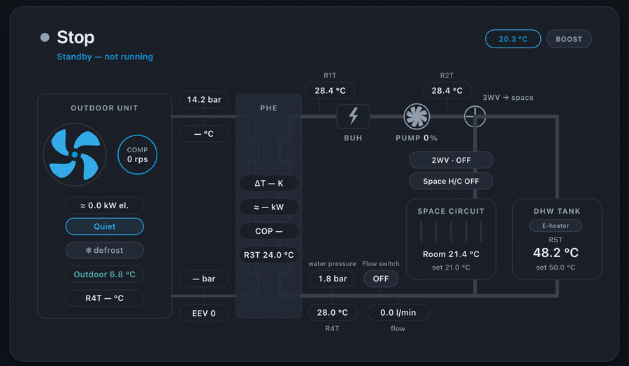

# daikin-altherma-esp32

ESP-IDF firmware: reads a **Daikin Altherma** over the **X10A** port (UART 9600 8E1, protocol I/S)
and publishes all values to MQTT. Runtime config + OTA via an
embedded web UI. ESP32-S3 only.

## Requirements

- A Daikin Altherma with an **X10A** header.
- A displayless ESP32-S3 board with ≥8 MB flash. The supported reference boards are the
  M5Stack AtomS3 Lite and Seeed XIAO ESP32-S3; boards with an integrated display are currently
  unsupported ([docs/BOARDS.md](docs/BOARDS.md)).
- A JST-EH 2.5 mm 5-pin connector to reach the X10A header.
- A browser with Web Serial to flash.

## Setup

1. Flash: [web installer](https://0bu.github.io/daikin-altherma-esp32/).
2. On a first install or after **Erase**, join AP `daikin-altherma-esp32-setup`
   (captive portal / `192.168.4.1`).
3. Configure at `http://daikin-altherma-esp32.local`.

## Wiring X10A

Breaker OFF. Three wires reach the heat pump: the two signals and ground.

| X10A | Signal | X10A wire | ESP32-S3 | Note |
| :---: | :--- | :--- | :--- | :--- |
| 1 | +5 V | Red | — | Optional — out of spec, prefer USB power |
| 2 | HP-TX | Brown | RX GPIO | Heat pump sends → ESP32 receives |
| 3 | HP-RX | Green | TX GPIO | ESP32 sends → heat pump receives |
| 4 | NC | — | — | Not connected |
| 5 | GND | Black | `GND` | Mandatory |

**Tell the firmware which two pins you used.** The signals can go to any two free GPIOs, so the
firmware cannot know them:

1. Wire HP-TX and HP-RX to two free GPIOs on your board.
2. Select those two in the RX/TX dropdown under **⚙ Settings → ESP32**. It lists only the GPIOs
   this chip allows. The choice is saved and reused on every boot.

Until that setting matches your wiring, no values arrive: the firmware tries the saved pins and its
built-in defaults (`RX 44` / `TX 43`) — it does not scan every pin. Mixing up RX and TX is harmless,
both orders are tried automatically; mixing up 5 V and GND is not.

Visual diagram, the full cable chain, and the wiring worked through on specific boards:
[docs/WIRING.md](docs/WIRING.md).

## UI

One screen, live from the bus: what the unit is doing right now, with any reading the firmware
cannot currently stand behind shown as `—` rather than as a number.

## Reference

| Doc | Description |
| :--- | :--- |
| [docs/README.md](docs/README.md) | Technical reference: protocol, HTTP API, values, build & flash |
| [docs/ARCHITECTURE.md](docs/ARCHITECTURE.md) | Deep internal reference: poll engine, MQTT bridge, WiFi/OTA |
| [docs/DESIGN.md](docs/DESIGN.md) | Web UI design contract (tokens, layout, states) |
| [docs/X10A_PROTOCOL.md](docs/X10A_PROTOCOL.md) | X10A wire protocol: framing, checksum, register pages, detection |
| [docs/MODBUS_PROTOCOL.md](docs/MODBUS_PROTOCOL.md) | The optional Modbus TCP source to a Daikin HomeHub (mDNS discovery, register map) |
| [docs/REGISTERS.md](docs/REGISTERS.md) | Register map + converter/enum tables behind the value catalog |
| [docs/HOME_ASSISTANT.md](docs/HOME_ASSISTANT.md) | MQTT topics, entities and derived (COP) sensors |
| [docs/WIRING.md](docs/WIRING.md) | Visual wiring diagram + picking RX/TX pins on other boards |
| [docs/BOARDS.md](docs/BOARDS.md) | Supported boards: what hardware each has and which parts the firmware uses |
| [docs/FEATURES.md](docs/FEATURES.md) | Catalog of platform features (Secure Boot, OTA, diagnostics, …) |
| [docs/PLANT.md](docs/PLANT.md) | Plant-level features: the 24 h checkup, weather forecast, ENV III input, heating-curve diagnosis |
| [docs/DIAGNOSTICS.md](docs/DIAGNOSTICS.md) | Plain-language user guide to every 24 h plant-diagnostics result and the supported next step |
| [docs/DIAGNOSTIC_EVIDENCE.md](docs/DIAGNOSTIC_EVIDENCE.md) | Sources, firmware rule, project heuristic and claim boundary for every plant diagnosis |
| [docs/SECURITY.md](docs/SECURITY.md) | Threat model + OTA signing/key lifecycle |
| [docs/MCP.md](docs/MCP.md) | Read-only MCP server plus a local self-documenting setup page |
| [docs/REPORTING.md](docs/REPORTING.md) | Reporting a bug: the public issue, the private device report, what gets redacted |
| [CONTRIBUTING.md](CONTRIBUTING.md) | What's useful to report, the local verification loop, how PRs land |

## Scope & credits

This firmware only ever reads the heat pump. X10A has no write command in the protocol, and the
optional HomeHub link has none in the code: no source file can even frame a Modbus write, and a CI
contract test keeps it that way ([docs/MODBUS_PROTOCOL.md](docs/MODBUS_PROTOCOL.md)). Other clients
on your LAN — the Onecta app, the unit's own controller, evcc — do write the hub; this firmware just
reports what they left behind.
Trusted LAN only; no API auth/TLS. MIT ([LICENSE](LICENSE)); protocol / value definitions derived
from [ESPAltherma](https://github.com/raomin/ESPAltherma) (MIT). No warranty; not affiliated with Daikin.
